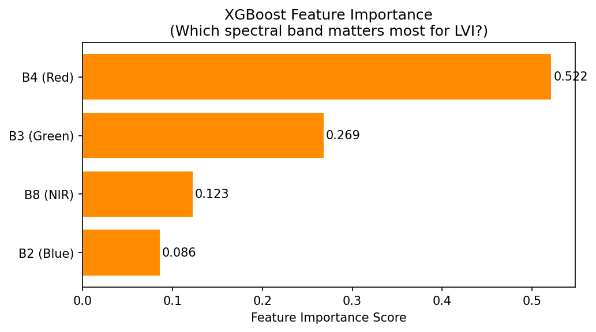
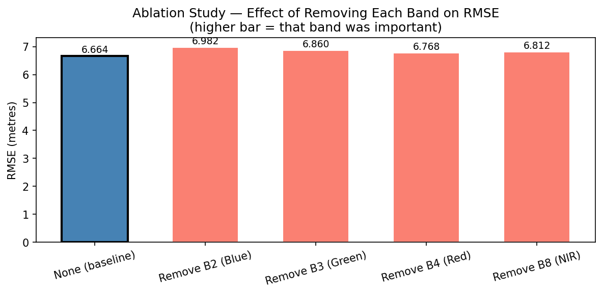

# Learned Vegetation Index (LVI)

**Group 2 — DSE-A**  
*Rushat Yadav (14), Anshika Goyal (37), Nischal Nori (26), Aviral Nigam (60), Vidushi Syal (55)*  
*School of Computer Engineering, MIT, MAHE, Manipal*  

*Predicting Forest Canopy Height Directly from Raw Sentinel-2 Spectral Bands*

---

## Table of Contents
- [Project Overview](#project-overview)
- [Key Methodology](#key-methodology)
  - [1. Multi-Region Data Assembly & Cleaning](#1-multi-region-data-assembly--cleaning)
  - [2. Downsampling & Class Balancing](#2-downsampling--class-balancing)
  - [3. Feature Scaling & Data Splitting](#3-feature-scaling--data-splitting)
  - [4. Baseline Vegetation Indices Comparison](#4-baseline-vegetation-indices-comparison)
- [Machine Learning Models](#machine-learning-models)
- [Results & Performance Metrics](#results--performance-metrics)
- [Visualizations & Analyses](#visualizations--analyses)
  - [Feature Importance](#feature-importance)
  - [Ablation Study](#ablation-study)
- [Repository Structure](#repository-structure)
- [Getting Started](#getting-started)

---

## Project Overview

Traditional vegetation indices such as **NDVI**, **EVI**, and **SAVI** rely on simple algebraic band ratios (primarily Red and Near-Infrared) designed decades ago as general proxies for greenness. However, when estimating complex physical traits like 98th-percentile canopy height (**`rh98`** in meters) across diverse biomes, fixed mathematical formulas often hit a saturation limit or misinterpret dense canopy structure.

The **Learned Vegetation Index (LVI)** leverages data-driven Machine Learning (**XGBoost** and Multi-Layer Perceptrons / **MLP**) to predict exact forest canopy height directly from raw Sentinel-2 satellite spectral reflectance bands:
- **B2** — Blue ($490\,\text{nm}$)
- **B3** — Green ($560\,\text{nm}$)
- **B4** — Red ($665\,\text{nm}$)
- **B8** — Near-Infrared / NIR ($842\,\text{nm}$)

---

## Key Methodology

The project pipeline is cleanly documented inside [`LVI_final.ipynb`](LVI_final.ipynb) and consists of four main preprocessing and evaluation stages:

### 1. Multi-Region Data Assembly & Cleaning
To build a globally generalizable model across distinct global forest architectures, paired Sentinel-2 Level-2A surface reflectance pixels and NASA GEDI LiDAR canopy height footprints (`RH98`) were collected across three major biomes during their respective dry seasons:
1. **Black Forest, Germany** (Jun–Dec 2022) — $\approx 138,650$ footprints
2. **Cerrado, Brazil** (Jun–Dec 2022) — $\approx 71,144$ footprints
3. **Western Ghats, India** (Nov 2020–Dec 2022) — $\approx 26,112$ footprints

> [!NOTE]
> **Upstream Google Earth Engine Script:**  
> The data extraction is handled by [`gee_collection.js`](gee_collection.js). It pulls cloud-filtered Sentinel-2 imagery (`< 20%` cloud probability) and quality-filtered NASA GEDI LiDAR data (`quality_flag == 1`, non-urban), matches them spatially at $25\,\text{m}$ resolution across $1^\circ \times 1^\circ$ representative bounding boxes, and exports raw CSV datasets containing `['B2', 'B3', 'B4', 'B8', 'rh98', 'region']`.

*Pre-processing highlights:*
- Null handling across all spectral bands and target height `rh98`.
- Outlier clipping for invalid LiDAR noise or cloud contamination, restricting `rh98` to $[0, 60]\,\text{m}$.

### 2. Downsampling & Class Balancing
Raw forest datasets exhibit severe natural skewness—vast areas of low grass/shrubs ($0\text{--}5\,\text{m}$) and very few towering old-growth trees ($>30\,\text{m}$). Furthermore, without balancing, models would bias toward heavily sampled regions like the Black Forest.
- To ensure equal regional representation, each region was downsampled to match the smallest dataset ($26,112$ rows), resulting in a balanced total dataset of **$78,336$ samples** across the three ecosystems.
- Canopy heights were binned into stratified height intervals (`bin_0_5m`, `bin_5_10m`, `bin_10_15m`, `bin_15_20m`, `bin_20_25m`, `bin_25m_plus`) so the machine learning models give equal learning weight to tall trees as they do to short vegetation.

### 3. Feature Scaling & Data Splitting
- Stratified $80/20$ Train/Test split ensures balanced canopy height distribution in both training and testing phases.
- **`StandardScaler`** is applied to features (`B2`, `B3`, `B4`, `B8`) fitted strictly on the training set to prevent data leakage.

### 4. Baseline Vegetation Indices Comparison
To ensure a fair apples-to-apples comparison against standard indices (which output dimensionless indices bounded around $[-1, 1]$), we fit a **Linear Regression** scaling layer to map traditional indices directly into physical height in meters:
$$\widehat{\text{rh98}} = w \cdot \text{Index} + b$$

---

## Machine Learning Models

We implement two core non-linear regression architectures:

1. **XGBoost Regressor (`LVI-XGBoost`)**
   - **Configuration:** `n_estimators=300`, `max_depth=6`, `learning_rate=0.05`
   - Captures complex multi-band non-linear interactions and threshold splits without saturating over dense forests.
2. **Multi-Layer Perceptron (`LVI-MLP`)**
   - **Configuration:** 2 hidden layers `(64, 32)`, ReLU activation, `Adam` optimizer with early stopping (`patience=10`).

---

## Results & Performance Metrics

Both machine learning models dramatically outperform standard algebraic vegetation indices across all evaluation metrics on the unseen test set:

| Model | RMSE (metres) $\downarrow$ | Pearson $r$ $\uparrow$ | $R^2$ Score $\uparrow$ |
| :--- | :---: | :---: | :---: |
| **NDVI (scaled)** | $8.554\,\text{m}$ | $0.565$ | $0.320$ |
| **EVI (scaled)** | $9.588\,\text{m}$ | $0.381$ | $0.145$ |
| **SAVI (scaled)** | $9.546\,\text{m}$ | $0.391$ | $0.153$ |
| **XGBoost (LVI)** | **$6.656\,\text{m}$** | $0.767$ | $0.588$ |
| **MLP (LVI)** | **$6.622\,\text{m}$** | **$0.770$** | **$0.592$** |

> [!TIP]
> **Key Takeaway:** By learning direct multi-spectral representations rather than fixed 2-band ratios, **LVI reduces canopy height estimation error by nearly 2 to 3 meters** and nearly doubles the variance explained ($R^2 \approx 0.59$ vs $R^2 = 0.32$ for NDVI).

---

## Visualizations & Analyses

### Feature Importance
Analysis of XGBoost gain and permutation importance reveals that while Near-Infrared (`B8`) and Red (`B4`) are important, incorporating Green (`B3`) and Blue (`B2`) reflectance provides critical structural context that traditional 2-band indices ignore.



### Ablation Study
To verify the necessity of each Sentinel-2 band, we systematically trained models with one spectral band removed at a time:

| Removed Band | Resulting RMSE | Impact |
| :--- | :---: | :--- |
| **None (Baseline - All 4 Bands)** | **$6.664\,\text{m}$** | Baseline benchmark |
| Remove **B4 (Red)** | $6.768\,\text{m}$ | Noticeable degradation |
| Remove **B8 (NIR)** | $6.812\,\text{m}$ | High degradation |
| Remove **B3 (Green)** | $6.860\,\text{m}$ | Severe degradation |
| Remove **B2 (Blue)** | **$6.982\,\text{m}$** | **Most severe degradation** |



---

## Repository Structure

```text
├── LVI_final.ipynb                   # Complete end-to-end data processing, training, & evaluation notebook
├── gee_collection.js                 # Google Earth Engine script for Sentinel-2 & GEDI data extraction
├── LVI_BlackForest1.csv              # Input dataset: Black Forest region
├── LVI_Cerrado1.csv                  # Input dataset: Brazilian Cerrado region
├── LVI_WesternGhats1.csv             # Input dataset: Western Ghats region
├── results_table_5.csv               # Exported evaluation metrics summary table
├── lvi_xgboost_model_5.pkl           # Saved production XGBoost model artifact
├── lvi_scaler_5.pkl                  # Saved StandardScaler fitted artifact
├── fig0_distributions_5.png          # Visual: Feature & target histograms
├── fig1_scatter_comparison_5.png     # Visual: Predicted vs. Actual scatter plots
├── fig2_feature_importance_5.png     # Visual: Spectral band importance scores
├── fig3_metrics_comparison_5.png     # Visual: Bar chart comparing RMSE / r / R²
└── fig4_ablation_5.png               # Visual: Spectral band ablation study bar chart
```

---

## Getting Started

1. **Clone the repository and install dependencies:**
   ```bash
   pip install numpy pandas scikit-learn xgboost matplotlib seaborn joblib jupyter
   ```

2. **Run the Notebook:**
   Launch `jupyter notebook` and open [`LVI_final.ipynb`](LVI_final.ipynb) to execute the full pipeline step-by-step or inspect intermediate distributions.

3. **Inference with Saved Artifacts:**
   ```python
   import joblib
   import numpy as np

   # Load pre-trained model and scaler
   scaler = joblib.load('lvi_scaler_5.pkl')
   model = joblib.load('lvi_xgboost_model_5.pkl')

   # Example raw Sentinel-2 reflectance inputs: [B2, B3, B4, B8]
   raw_bands = np.array([[350, 520, 410, 2800]])
   scaled_bands = scaler.transform(raw_bands)

   predicted_height = model.predict(scaled_bands)
   print(f"Predicted Canopy Height: {predicted_height[0]:.2f} meters")
   ```
